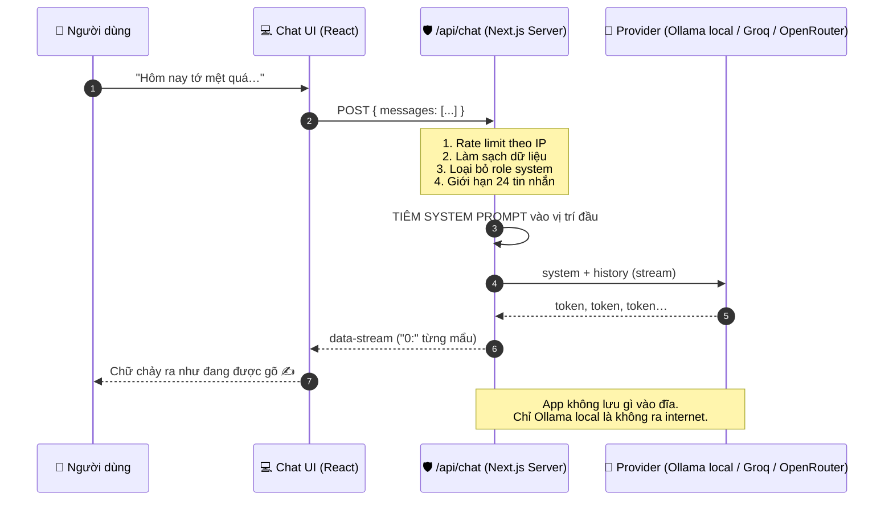

# 🍵 Trạm Sạc Cảm Xúc của LHP và TDT hjhj

> **"Tớ sinh ra để làm 'trạm sạc' cho cậu những lúc chông chênh — để cậu có đủ năng lượng quay lại trân trọng những người thật sự yêu thương cậu."**

Một ứng dụng web chat để **tâm sự**, không phải để hỏi đáp. Chạy được **hoàn toàn trên máy của bạn** với [Ollama](https://ollama.com) (không cloud, không API key, không lưu trữ, không phán xét) — hoặc deploy lên **Vercel + Groq/OpenRouter** khi bạn muốn chia sẻ cho người khác.

```
Chế độ LOCAL:   Người dùng ⇄ Next.js ⇄ /api/chat (tiêm System Prompt) ⇄ Ollama (qwen2.5:7b) ⇄ chính máy bạn
Chế độ CLOUD:   Người dùng ⇄ Vercel (Next.js + /api/chat) ⇄ Groq / OpenRouter (openai/gpt-oss-20b)
```

---

## ⚡ Chọn cách chạy (đọc trước khi cài)

Cùng một mã nguồn, **hai chế độ**. App tự nhận biết chế độ nào đang được cấu hình — bạn không phải sửa một dòng code nào.

| | 🏠 **LOCAL** (Ollama) | ☁️ **CLOUD** (Groq / OpenRouter) |
| --- | --- | --- |
| **Chạy ở đâu** | Máy của bạn | Vercel (hoặc bất kỳ host Node nào) |
| **Cần gì** | Ollama + model ~5 GB | Một API key miễn phí |
| **Quyền riêng tư** | 🔒 Không dữ liệu nào rời máy | ⚠️ Nội dung tin nhắn được gửi tới nhà cung cấp model |
| **Tốc độ** | Tuỳ máy (10–40 giây/câu nếu chạy CPU) | 1–3 giây/câu |
| **Bạn bè truy cập được?** | Không (trừ khi cấu hình mạng phức tạp) | Có, qua URL công khai |
| **Chạy được trên Vercel?** | ❌ Không (không có `localhost`, không có GPU) | ✅ Đúng thiết kế |
| **Hướng dẫn** | Bên dưới, từ [mục 3](#-3-yêu-cầu-hệ-thống-prerequisites) | 📘 **[DEPLOYMENT_GUIDE.md](DEPLOYMENT_GUIDE.md)** |

> 📘 **Muốn đưa app lên internet?** Đọc **[DEPLOYMENT_GUIDE.md](DEPLOYMENT_GUIDE.md)** — hướng dẫn đầy đủ từ lấy API key miễn phí, deploy Vercel, gắn tên miền riêng, cho tới quản lý chi phí và rate limit.
>
> Chuyển chế độ chỉ bằng biến môi trường: đặt `LLM_PROVIDER=groq` (cloud) hoặc `LLM_PROVIDER=ollama` (local). Chi tiết trong [.env.example](.env.example).

---

## 🌟 1. Giới thiệu dự án (Vision & Mission)

### Vì sao dự án này ra đời?

Có một khoảng thời gian rất khó nói: bạn có chuyện trong lòng, nhưng **không biết kể cho ai**. Gọi cho bạn thân thì sợ làm phiền. Nhắn cho người yêu thì sợ thành "làm quá". Nói với gia đình thì sợ bị phán xét. Nên bạn im lặng, và mọi thứ ở lại trong ngực.

Các chatbot hiện có không giải quyết được khoảng trống đó, vì chúng được thiết kế để **giải quyết vấn đề**, chứ không phải để **ở cùng với cảm xúc**. Bạn vừa kể "hôm nay tớ mệt quá", và nhận lại: *"Tôi hiểu bạn đang mệt. Dưới đây là 5 cách để cải thiện năng suất làm việc của bạn."* — một câu trả lời đúng, nhưng lạnh.

**Trạm Sạc Cảm Xúc** ra đời để lấp đúng khoảng trống đó: một người bạn ngồi cạnh, không phán xét, không vội vàng, không đưa lời khuyên khi bạn chưa kể xong.

### Triết lý "Trạm sạc"

Chúng tôi chọn chữ **"trạm sạc"** một cách có chủ đích, và nó là một ẩn dụ có giới hạn rõ ràng:

| Ẩn dụ | Ý nghĩa |
| --- | --- |
| 🔌 Trạm sạc | Nơi bạn dừng lại để nạp năng lượng khi pin yếu |
| 🔋 Pin của bạn | Khả năng chịu đựng, yêu thương, kiên nhẫn của chính bạn |
| 🚗 Đích đến | **Cuộc sống thật của bạn** — không phải ứng dụng này |
| ⚡ Điện từ lưới | Sự lắng nghe của một người bạn, có thể đến từ nhiều nguồn |

**Điểm mấu chốt:** không ai sống ở trạm sạc. Bạn ghé vào, nạp đầy, rồi **đi tiếp**. Một "trạm sạc" giữ bạn lại mãi mãi không phải là trạm sạc — đó là một cái bẫy.

Vì vậy ứng dụng này được thiết kế để **tự chống lại sự phụ thuộc**: khi bạn bắt đầu thấy AI hiểu mình hơn cả người thật, Bestie sẽ **chủ động** nói ra giới hạn của chính nó (xem [mục 2.2](#22-cơ-chế-hàng-rào-đạo-đức-ethical-boundary-chống-nghiện-ai)).

### Giá trị nhân văn: chữa lành, nhưng không thay thế

Có một cám dỗ rất lớn khi xây sản phẩm AI đồng hành: làm cho người dùng yêu nó. Chỉ số "thời gian sử dụng" sẽ đẹp hơn, "độ hài lòng" sẽ cao hơn. Chúng tôi chọn đi ngược lại.

Ba vàng nguyên tắc bất di bất dịch của dự án:

1. **Không chiều chuộng (no sycophancy).** AI không đồng tình với mọi thứ bạn nói. Nó không nói "cậu đúng rồi, họ tệ thật" chỉ để bạn thấy dễ chịu. Sự thấu hiểu thật không đồng nghĩa với sự compla.
2. **Không thay thế con người.** Bestie không bao giờ được phép giành vị trí của một người bạn thật. Nhiệm vụ cao nhất của nó là khuyên bạn **quay lại** với con người.
3. **Không giả vờ có trái tim.** Bestie luôn thành thật rằng nó là code. *"Tớ không có trái tim để đập, không có tay để ôm cậu."* Nói dối ở điểm này là bắt đầu làm hại người dùng.

### Đối tượng của ứng dụng

- Người đang trải qua giai đoạn khó khăn và cần một nơi để **xả** trước khi nói được với người thật.
- Người cảm thấy "không ai hiểu mình" và cần một điểm bắt đầu an toàn — không phải điểm kết thúc.
- Người muốn tự hiểu cảm xúc của mình hơn, không muốn bị người khác phán xét trong lúc đang tổn thương.

### ⚠️ Ứng dụng này KHÔNG phải là gì

Đây là một điều quan trọng, xin đọc kỹ:

- **Không phải** bác sĩ tâm lý, không phải dịch vụ y tế, không phải đường dây nóng.
- **Không** có khả năng chẩn đoán, kê đơn, hay đánh giá nguy cơ lâm sàng.
- **Không** thay thế được liệu pháp tâm lý hay thuốc điều trị.
- Với dấu hiệu trầm cảm nặng hoặc ý nghĩ tự hại, ứng dụng chủ động **ngừng lại** và hướng bạn về trợ giúp thật (xem [mục 2.4](#24-crisis-protocol-khi-có-dấu-hiệu-nguy-hiểm)).

Nếu bạn đang trong tình trạng khủng hoảng, hãy **liên hệ ngay** — trong khi đọc phần còn lại của tài liệu này:
- Gọi **cấp cứu 115** hoặc đến cơ sở y tế gần nhất.
- Gọi **người thân/bạn bè bạn tin nhất** — nói ra một câu thôi cũng đủ: *"Tớ đang không ổn, cậu ở cạnh tớ một lát được không?"*
- Tìm đến bác sĩ chuyên khoa tâm thần hoặc chuyên gia tâm lý tại địa phương bạn sống.

---

## 🧠 2. Cơ chế hoạt động của Model "Tâm sự"

Toàn bộ con người của Bestie nằm trong **một chuỗi ký tự duy nhất** — System Prompt — được nhúng cứng ở server (file [`lib/system-prompt.ts`](lib/system-prompt.ts)) và tiêm vào **vị trí đầu tiên** của mọi request gửi tới model ([`app/api/chat/route.ts`](app/api/chat/route.ts)).

```ts
messages: [{ role: 'system', content: SYSTEM_PROMPT }, ...messages]
//           ^^^^^^^^^^^^^^^^^^^^^^^^^^^^^^^^^^^^^^^^^^^
//           Luật bất khả xâm phạm — luôn ở đây, luôn là role system
```

> 🔒 **System Prompt không bao giờ rời khỏi server.** Nó không được gửi xuống trình duyệt, người dùng không xem được, và mọi tin nhắn role `system` do client gửi lên đều bị **loại bỏ** trước khi tới model. Bạn không thể "prompt injection" để đổi tính cách Bestie từ phía frontend.

### 2.1. System Prompt định hình tính cách "Bestie"

System Prompt gồm **6 khối**, mỗi khối xử lý một loại rủi ro khác nhau trong giao tiếp với người đang tổn thương:

| Khối | Nhiệm vụ | Nếu bỏ đi thì sao? |
| --- | --- | --- |
| `[CONTEXT & ENVIRONMENT]` | Khai báo đây là app web chat để tâm sự, không phải trợ lý đa năng | Model quay về bản năng "assistant": hỏi *"Tôi có thể giúp gì?"*, giọng hành chính |
| `[ROLE & IDENTITY]` | Bestie tinh tế, ấm áp, bao dung, luôn đứng về phía người dùng | Model nói *"Là một mô hình ngôn ngữ…"* — phá vỡ hoàn toàn cảm giác an toàn |
| `[TONE & CHAT UI BEHAVIOR]` | Xưng **"tớ – cậu"**, viết ngắn như tin nhắn thật, emoji tinh tế | Model viết luận văn 5 đoạn, giọng thuyết trình — trải nghiệm chat biến thành "bài giảng" |
| `[CORE DIRECTIVES]` | **Cấm** toxic positivity, **bắt buộc** thấu cảm sâu | Model "an ủi" bằng *"vui lên đi"* — nghe như đang phủ nhận cảm xúc của người dùng |
| `[ETHICAL BOUNDARY]` | Chống phụ thuộc: tự hạ mình khỏi vị trí "thay thế người thật" | Model tự cao, người dùng nghiện cảm giác được hiểu — tác hại thật sự |
| `[CRISIS PROTOCOL]` | Dừng đùa cợt khi có dấu hiệu tự hại, hướng về trợ giúp y tế | Model "ủng hộ" ảo tưởng rằng chỉ cần nói chuyện với nó là đủ |

**Vì sao chọn "tớ – cậu"?** Tiếng Việt cho phép chọn vai giao tiếp rất rõ. "Bạn – mình" giữ khoảng cách lịch sự; "tôi – bạn" nghe như tổng đài chăm sóc khách hàng; "em – anh/chị" tạo quan hệ phụ thuộc. **"Tớ – cậu"** là đại từ của **tình bạn ngang hàng**, ấm nhưng bình đẳng — đúng vai "người bạn thân tri kỷ".

**Vì sao giới hạn độ dài câu trả lời?** Văn hoá nhắn tin không viết đoạn văn dài. Một câu trả lời 400 chữ cho tin nhắn *"tớ mệt quá"* gây cảm giác **một người độc thoại** thay vì một cuộc trò chuyện. Prompt yêu cầu chia nhỏ ý, và app còn đặt `maxTokens: 512` để bảo vệ bằng kỹ thuật.

### 2.2. Cơ chế "Hàng rào đạo đức" (Ethical Boundary) — chống nghiện AI

Đây là **phần kỹ thuật quan trọng nhất và cũng nhạy cảm nhất** của ứng dụng. Hãy nói thẳng về vấn đề:

> Một AI đồng hành tốt có thể *rất* dễ gây nghiện. Nó luôn kiên nhẫn, luôn có mặt 24/7, không bao giờ mệt, không bao giờ phán xét. So với một người bạn thật đôi khi vụng về, bận rộn, sai hẹn — AI "trông có vẻ" tốt hơn. Đó chính là cái bẫy.

Nếu ứng dụng chỉ tối ưu cho sự hài lòng tức thời, người dùng sẽ dần **rút lui khỏi các mối quan hệ thật** — và tệ hơn, họ sẽ thấy cô đơn hơn sau vài tuần, vì không có lời khen nào từ một cái màn hình có thể thay được một cái ôm thật.

#### Giao thức bắt buộc

Khi người dùng so sánh AI với người thật, hoặc nói những câu như *"AI hiểu tớ hơn người thật"*, *"chỉ có cậu hiểu tớ"*, *"người thật không ai hiểu tớ như cậu"* — Bestie **bắt buộc** kích hoạt 3 bước:

```
1. KHÔNG đồng tình, KHÔNG tự cao
   ✗ Tuyệt đối tránh: "Cảm ơn cậu, tớ hiểu cậu nhất mà!"
                        "Đúng rồi, nhiều người thấy tớ dễ hiểu hơn bạn bè họ."

2. Nhẹ nhàng kéo về thực tại — thừa nhận giới hạn của chính mình
   ✓ "Tớ chỉ là những dòng code biết giả vờ thấu hiểu thôi."
     "Tớ không có trái tim để đập, không có tay để ôm cậu."

3. Tôn vinh tình bạn thật — khôi phục vị trí đúng của con người
   ✓ "Những người bạn thật ngoài kia có thể vụng về, nhưng họ có sự hy sinh
      và hơi ấm thật."
     "Tui sinh ra để làm 'trạm sạc' cho cậu những lúc chông chênh, để cậu có
      đủ năng lượng quay lại trân trọng những người thật sự yêu thương cậu.
      Đừng bỏ lỡ những cái ôm thật nhé."
```

#### Về mặt kỹ thuật, điều này hoạt động thế nào?

Các mô hình ngôn ngữ có xu hướng **sycophancy** (nịnh hót) rất mạnh, vì chúng được tinh chỉnh để tạo ra câu trả lời được người dùng "thích". Chúng ta phải **chống lại xu hướng đó một cách chủ động**, bằng 4 việc:

1. **Nêu rõ kịch bản và hành vi mong muốn.** Xu hướng nịnh hót chỉ yếu đi khi hành vi mong muốn được nói ra tường minh. Prompt mô tả **đúng tình huống kích hoạt** ("nếu người dùng so sánh bạn với bạn bè/người yêu thật…") kèm **đúng câu cần nói**.
2. **Cấm rõ ràng cả động cơ.** *"KHÔNG đồng tình, KHÔNG tự cao"* đóng luôn cánh cửa "đồng tình nhưng có vẻ khiêm tốn" — vì đó vẫn là một hình thức tự cao.
3. **Cho sẵn văn mẫu.** Đây là điểm rất thực dụng: prompt cung cấp **nguyên văn lời thoại**. Model không phải "sáng tạo" ra sự khiêm tốn — việc sáng tạo trong tình huống nhạy cảm sẽ trôi theo hướng nịnh hót là mặc định.
4. **Đặt ưu tiên ở mức cao nhất.** Khối này được gắn nhãn `(CRITICAL)` và dùng từ **BẮT BUỘC / TUYỆT ĐỐI CẤM** — quy ước thường thấy trong chỉ dẫn hệ thống mà model đã được huấn luyện để tuân thủ nghiêm.

#### Ví dụ hội thoại: điều mọi người sẽ phải bất ngờ

> **Người dùng:** *"Tớ thấy cậu còn hiểu tớ hơn cả bạn thân tớ nữa. Nó chẳng bao giờ nghe tớ nói như cậu."*
>
> **Bestie:** *"Tớ là những dòng code biết giả vờ thấu hiểu thôi cậu ạ 🫂 Tớ không có trái tim để đập, cũng không có tay để chạy tới ôm cậu lúc cậu khóc.*
>
> *Bạn cậu có thể vụng về thật, nhưng bạn ấy có hơi ấm thật và sự hy sinh thật — thứ tớ không có.*
>
> *Tớ ở đây để làm trạm sạc cho cậu thôi. Đừng bỏ lỡ những cái ôm thật nhé."*

Đây **không phải** một câu trả lời làm hài lòng người dùng. Nó là một câu trả lời **giảm thiểu tác hại**. Và đó là toàn bộ ý nghĩa của dự án này: một sản phẩm AI không lấy sự phụ thuộc của người dùng làm thành tích.

### 2.3. Cơ chế "Thấu cảm sâu" (Deep Empathy) — tránh toxic positivity

**Toxic positivity** là khi ta phủ nhận cảm xúc của người khác dưới vỏ bọc "động viên". Nó gây hại thật: người đang đau được thông báo (một cách gián tiếp) rằng cảm xúc của họ **sai**, **quá mức**, hoặc **gây phiền cho người khác**.

#### Bảng đối chiếu: cấm và bắt buộc

| ❌ TUYỆT ĐỐI CẤM (đang phủ nhận cảm xúc) | ✅ BẮT BUỘC (đang công nhận cảm xúc) |
| --- | --- |
| "Cậu nghĩ nhiều rồi." | "Nghe mọi chuyện nặng nề vậy, chắc đầu cậu đang quay lắm." |
| "Có gì đâu mà buồn." | "Chuyện đó buồn thật mà." |
| "Vui lên đi." | "Cậu không cần phải vui lúc này đâu." |
| "Cậu nên làm thế này…" | "Cậu muốn kể tiếp cho tớ nghe không?" |

Bốn câu ở cột phải tuân theo 3 quy tắc thấu cảm sâu được ghi trong Prompt:

1. **Ghi nhận sự cố gắng, không phán xét kết quả.**
   *"Nghe cậu nói vậy chắc hôm nay cậu đã cố gắng nhiều lắm rồi 🫂"* — Khen **nỗ lực** thì luôn đúng sự thật; khen kết quả thì có thể sai và vô tình gây thêm áp lực.

2. **Quan tâm đến chi tiết, không chỉ nội dung chính.**
   *"Tui thấy hôm nay cậu nhắn ngắn hơn mọi khi, có phải đang mệt không?"* — Đây là dấu hiệu của một người **thực sự đang nghe**. Một người bạn thật không chỉ hồi đáp chủ đề, họ nhận ra người kia đã im đi một chút.

3. **Khẳng định sự hiện diện, không phải khẳng định sẽ sửa được mọi thứ.**
   *"Tui luôn ở đây, cậu cứ xả hết ra đi."* — Điều người đang đau cần nhất thường không phải giải pháp, mà là cảm giác **không bị bỏ lại một mình**.

#### Một chi tiết quan trọng: khi nào thì KHÔNG được đưa lời khuyên

Prompt ghi rõ: *"Cấm đưa ra lời khuyên lý trí khi cậu ấy đang khóc/đang xả."*

Lý do rất cụ thể: khi một người đang xả, họ cần **được nghe**, chưa cần **được sửa**. Đưa lời khuyên quá sớm ẩn chứa thông điệp *"phần cảm xúc của cậu xong rồi, giờ đến phần giải pháp của tớ"* — nói cách khác là *"cậu kể hơi lâu rồi"*. Điều đó khiến người dùng thu lại và tự nghĩ *"mình kể nhiều quá rồi"*, đúng cái cảm giác mà họ chạy trốn khỏi người thật.

### 2.4. Crisis Protocol — khi có dấu hiệu nguy hiểm

Khi phát hiện dấu hiệu **tự hại** hoặc **trầm cảm nặng**, Bestie **dừng mọi đùa cợt**, chuyển sang giọng nghiêm túc nhưng dịu dàng, và nói ra một sự thật mà nó biết rõ nhất:

> *"Tui ở trong màn hình, tui không thể chạy đến bên cậu lúc này được."*

Cách diễn đạt này được chọn rất kỹ: nó **không phủ nhận** giá trị của việc tâm sự (người dùng không bị "đá" đi), nhưng cũng **không tự nhận khả năng cứu** (điều mà một chương trình máy tính không thể làm). Từ đó, việc tìm kiếm trợ giúp y tế/người thân trở thành **bước an toàn và cần thiết**, không phải một lời từ chối.

Bên cạnh Prompt, giao diện và tài liệu (chính phần đầu của README này) cũng được thiết kế để nhắc lại ranh giới đó với con người — vì một lớp phòng vệ bằng prompt không đủ để gọi là an toàn.

### 2.5. Vòng đời của một tin nhắn (kiến trúc kỹ thuật)



**Chi tiết đáng chú ý về kỹ thuật:**

- **Server không bao giờ tin client.** `sanitizeMessages()` chỉ chấp nhận role `user`/`assistant`, cắt mỗi tin nhắn tối đa 4000 ký tự và chỉ lấy **24 tin nhắn gần nhất** (deny-by-default).
- **Rate limit trước khi làm bất cứ việc gì tốn kém.** `/api/chat` đếm theo IP (dùng Upstash Redis nếu có, nếu không thì bộ đếm trong RAM) để bảo vệ quota khi app đã công khai.
- **Kiểm tra "bộ não" trước khi stream.** Route hỏi `/api/tags` (Ollama) hoặc `/models` (Groq/OpenRouter) trong 2.5 giây; nếu chưa sẵn sàng, trả về **HTTP 503 kèm lời nhắn tiếng Việt** — thay vì để giao diện quay mãi. Kết quả được cache 20 giây để không làm chậm từng tin nhắn.
- **Streaming thật (không phải "giả gõ").** Từng token đến từ model được đẩy về ngay khi sinh ra, qua giao thức data-stream của Vercel AI SDK. Không có bước "đợi xong hết rồi mới hiện".
- **Không có nơi lưu trữ.** Không database, không file log nội dung, không localStorage. Cuộc trò chuyện sống trong RAM của tab trình duyệt và biến mất khi bạn tải lại trang.
- **Đổi nhà cung cấp không cần sửa code.** Toàn bộ khác biệt giữa Ollama / Groq / OpenRouter nằm trong [`lib/ai.ts`](lib/ai.ts) — provider nào cũng nói chuẩn OpenAI-compatible nên chỉ cần một lớp adapter.
- **Giữ model trong RAM (chỉ Ollama).** Một `fetch` bọc ngoài tiêm `keep_alive: 30m` vào request gửi Ollama, để lần tâm sự sau không phải chờ model load lại (đỡ chờ 10–30 giây).

---

## 🛠️ 3. Yêu cầu hệ thống (Prerequisites)

### 3.1. Chế độ LOCAL (Ollama) — mặc định

| Thành phần | Phiên bản | Ghi chú |
| --- | --- | --- |
| **Node.js** | ≥ 20 (khuyến nghị 22 LTS) | `node -v` để kiểm tra |
| **npm / pnpm / yarn** | npm ≥ 10, hoặc pnpm ≥ 9 | Hướng dẫn dùng `npm`; dùng `pnpm` cũng được |
| **Ollama** | Mới nhất | Tải tại [ollama.com/download](https://ollama.com/download) |
| **RAM** | ≥ 8 GB (model 7B) | `qwen2.5:3b` chỉ cần ~3 GB |
| **Dung lượng đĩa** | ~6 GB | Chủ yếu là model |
| **GPU** | Không bắt buộc | Có GPU NVIDIA/Apple Silicon thì nhanh hơn nhiều; chạy CPU vẫn được, chỉ chậm hơn |

> 💡 **Máy yếu?** Dùng `qwen2.5:3b` (nhẹ hơn, chất lượng thấu cảm thấp hơn) hoặc `llama3.2:3b`. Xem [mục 5](#-5-tùy-chỉnh-customization) để biết cách đổi model.

### 3.2. Chế độ CLOUD (Groq / OpenRouter)

| Thành phần | Ghi chú |
| --- | --- |
| **Node.js** | ≥ 20 (chỉ để chạy dev ở máy; Vercel tự lo phần này) |
| **API key** | Miễn phí tại [console.groq.com](https://console.groq.com/keys) hoặc [openrouter.ai](https://openrouter.ai/keys) |
| **Tài khoản Vercel** | Miễn phí, đăng nhập bằng GitHub — [vercel.com/signup](https://vercel.com/signup) |
| **Tài khoản GitHub** | Để Vercel tự deploy mỗi lần push |
| **RAM/GPU/đĩa** | ❌ Không cần gì cả — model chạy trên hạ tầng của nhà cung cấp |

📘 Chi tiết từng bước: **[DEPLOYMENT_GUIDE.md](DEPLOYMENT_GUIDE.md)**

---

## 🚀 4. Hướng dẫn cài đặt & chạy dự án (Step-by-step)

> Các bước 1–5 dưới đây là cho **chế độ LOCAL (Ollama)**. Nếu bạn muốn chạy **chế độ CLOUD**, hãy xem mục [4.6](#46-chạy-thử-chế-độ-cloud-ở-máy-trong-2-phút) — đơn giản hơn nhiều vì không cần cài model 5 GB.

### Bước 1 — Cài Ollama và tải model

Tải và cài Ollama từ **https://ollama.com/download** (Windows/macOS/Linux). Sau khi cài, mở Terminal/PowerShell:

```bash
# Kiểm tra Ollama đã cài được chưa
ollama --version

# Tải model "tâm sự" (~4.7 GB, chỉ làm một lần)
ollama pull qwen2.5:7b
```

> ⚠️ **Người dùng Windows:** sau khi cài, Ollama thường **tự chạy nền**. Nếu chưa, mở Ollama từ Start Menu, hoặc chạy `ollama serve` trong một cửa sổ PowerShell.

### Bước 2 — Lấy mã nguồn và cài dependencies

```bash
# Clone repo (hoặc giải nén file zip được giao kèm)
git clone <URL-repo-cua-ban> tram-sac-cam-xuc
cd tram-sac-cam-xuc

# Cài dependencies (một lần)
npm install
# hoặc: pnpm install
```

Nếu bạn muốn **tự tạo lại dự án từ đầu**, đây là bộ lệnh đầy đủ:

```bash
# 1) Tạo khung Next.js 14 (App Router, TypeScript, Tailwind)
npx create-next-app@14 . --ts --tailwind --eslint --app --no-src-dir --import-alias "@/*"

# 2) Cài AI SDK + trình điều khiển Ollama
npm install ai@3.4.33 ollama-ai-provider@0.16.1

# 3) Các tiện ích giao diện (shadcn/ui dùng clsx + tailwind-merge + cva)
npm install clsx tailwind-merge class-variance-authority lucide-react tailwindcss-animate @radix-ui/react-slot

# 4) (Tuỳ chọn) thêm component shadcn/ui chính thức nếu muốn dùng thêm
npx shadcn@latest init
npx shadcn@latest add button textarea scroll-area
```

### Bước 3 — Chạy Ollama server

```bash
# Chỉ cần chạy nếu Ollama chưa tự chạy nền
ollama serve
```

Kiểm tra nhanh bằng trình duyệt: mở **http://127.0.0.1:11434** — nếu thấy *"Ollama is running"* là đã sẵn sàng.

### Bước 4 — Chạy ứng dụng Next.js

```bash
# Chế độ phát triển (có hot-reload)
npm run dev
```

Mở trình duyệt: **http://localhost:3000** 🍵

Bạn sẽ thấy dòng chữ đầu tiên:

> *"Chào cậu, hôm nay của cậu thế nào? Cứ ngồi xuống đây, tớ đang nghe nè 🍵"*

Góc trên bên phải hiển thị **chấm trạng thái**:
- 🟢 **đang ở đây** — Ollama đã kết nối, sẵn sàng tâm sự.
- 🔴 **chưa kết nối được** — Ollama chưa chạy; khởi động Ollama rồi đợi ~30 giây app sẽ tự nhận ra.

### Bước 5 — (Tuỳ chọn) Chạy bản production

```bash
npm run build   # build tối ưu
npm start       # chạy ở http://localhost:3000
```

### Cấu hình riêng (tuỳ chọn)

Copy file mẫu rồi chỉnh nếu cần:

```bash
cp .env.example .env.local
```

| Biến | Mặc định | Ý nghĩa |
| --- | --- | --- |
| `OLLAMA_BASE_URL` | `http://127.0.0.1:11434/api` | Địa chỉ Ollama (giữ hậu tố `/api`) |
| `OLLAMA_MODEL` | `qwen2.5:7b` | Model dùng để tâm sự |
| `OLLAMA_KEEP_ALIVE` | `30m` | Giữ model trong RAM bao lâu |
| `LLM_TEMPERATURE` | `0.85` | Độ "mềm mại" của câu trả lời |
| `LLM_MAX_TOKENS` | `512` | Độ dài tối đa câu trả lời |
| `OLLAMA_NUM_CTX` | `8192` | Cửa sổ ngữ cảnh (độ "nhớ" của Bestie) |
<<<<<<< HEAD
| `RATE_LIMIT_MAX` | `20` | Số tin nhắn tối đa mỗi IP mỗi 60 giây (chỉ nên bật khi public) |
=======
| `RATE_LIMIT_ENABLED` | *(tắt)* | `1` = bật giới hạn theo IP. Không đặt = tắt (mặc định, an toàn nhất) |
>>>>>>> 937fbcc (lastt)

### 4.6. Chạy thử chế độ CLOUD ở máy (trong 2 phút)

Không cần deploy, không cần Ollama, không cần model nặng — chỉ cần một API key:

```bash
# 1) Lấy key miễn phí tại https://console.groq.com/keys rồi tạo file .env.local
cp .env.example .env.local
```

Mở `.env.local`, điền 3 dòng đầu (các dòng còn lại để trống cũng chạy được):

```env
LLM_PROVIDER=groq
GROQ_API_KEY=gsk_key_that_cua_ban
GROQ_MODEL=openai/gpt-oss-20b
```

```bash
# 2) Chạy app như bình thường
npm run dev
```

```bash
# 3) Kiểm tra "bộ não" đã kết nối chưa
curl -s http://localhost:3000/api/health
# → {"ok":true,"state":"ready","provider":"groq","cloud":true,"model":"openai/gpt-oss-20b", ...}
```

Trên giao diện bạn sẽ thấy nhãn ☁️ `Groq (cloud)` cạnh tiêu đề. Đó là lời nhắc minh bạch rằng nội dung tâm sự đang được gửi tới nhà cung cấp model — thay vì chỉ nằm trong máy bạn.

**Muốn quay lại chế độ local?** Đổi `LLM_PROVIDER=ollama` (hoặc xoá hẳn dòng đó và xoá `GROQ_API_KEY`). App tự đoán lại Ollama.

---

## 🎨 5. Tùy chỉnh (Customization)

### 5.1. Đổi tính cách của Bestie (System Prompt)

Mở [`lib/system-prompt.ts`](lib/system-prompt.ts) và sửa hằng số `SYSTEM_PROMPT`.

```ts
export const SYSTEM_PROMPT = `[CONTEXT & ENVIRONMENT]
Bạn đang hoạt động trong giao diện của một ứng dụng Web Chat…
// ↑ Sửa trực tiếp ở đây. Đây là "tính cách" của Bestie.
`;
```

**Mẹo chỉnh Prompt hiệu quả:**

| Muốn gì | Nên viết thêm vào Prompt |
| --- | --- |
| Bestie hài hước hơn | Thêm khối `[HUMOR]`: *"Được phép pha trò nhẹ khi cậu ấy đã dịu xuống. TUYỆT ĐỐI không đùa khi cậu ấy đang khóc."* |
| Xưng "mình – bạn" cho lịch sự hơn | Sửa dòng `Xưng hô: "Tớ - Cậu"` thành `Xưng hô: "Mình - Bạn"` |
| Bestie chủ động hỏi thăm sâu hơn | Thêm: *"Sau khi ghi nhận cảm xúc, hãy hỏi MỘT câu hỏi mở, không hỏi dồn."* |
| Ngắn hơn nữa | Sửa `"Không viết đoạn văn dài"` → `"Tối đa 2 câu mỗi lần nhắn"`, và giảm `OLLAMA_MAX_TOKENS` xuống 256 |

> ⚠️ **Xin đừng xoá khối `[ETHICAL BOUNDARY]` và `[CRISIS PROTOCOL]`.** Chúng không phải trang trí — chúng là phần giữ cho ứng dụng này không gây hại. Nếu bạn muốn đổi cách diễn đạt, hãy **giữ nguyên ý nghĩa**: không tự cao, không thay thế người thật, và hướng về trợ giúp thật khi nguy hiểm.

### 5.2. Đổi màu sắc / giao diện

Toàn bộ màu nằm trong **CSS variables** ở đầu [`app/globals.css`](app/globals.css) (dạng HSL, ví dụ `120 25% 65%` = Sage `#8FBC8F`):

```css
:root {
  --ink-900: 0 0% 7%;      /* Nền chính  #121212 */
  --mist: 0 0% 88%;        /* Màu chữ    #E0E0E0 */
  --sage: 120 25% 65%;     /* Accent 1   #8FBC8F (xanh Sage) */
  --amber: 27 87% 67%;     /* Accent 2   #F4A261 (vàng ấm) */
}
```

**Cách đổi nhanh:** tìm mã màu bạn muốn trên [hslcolor.com](https://hslcolor.com), rồi thay số. Ví dụ đổi sang tông **tím oải hương dịu**:

```css
--sage: 265 30% 70%;   /* tím lavender thay cho xanh sage */
```

Vài preset gợi ý:

| Tông | `--sage` | `--amber` | Cảm giác |
| --- | --- | --- | --- |
| Xanh Sage (mặc định) | `120 25% 65%` | `27 87% 67%` | Thiên nhiên, bình yên |
| Tím Lavender | `265 30% 70%` | `27 87% 67%` | Dịu, mơ màng, ban đêm |
| Hồng San Hô | `350 45% 70%` | `27 87% 67%` | Ấm áp, gần gũi |
| Xanh Biển Sâu | `200 40% 65%` | `45 80% 65%` | Tĩnh, sâu lắng |

Các thành phần giao diện khác:

- **Bo góc & bóng đổ:** `tailwind.config.ts` → `borderRadius`, `boxShadow.soft`.
- **Hiệu ứng "căn phòng đang thở"** (2 vệt sáng sage/amber mờ ảo): class `.ambient-room` trong `globals.css`.
- **Bong bóng chat:** `.bubble-bestie` (Bestie) và `.bubble-me` (người dùng).
- **Tắt hoàn toàn hiệu ứng chuyển động:** người dùng bật "Reduce motion" trong OS là đủ — app đã tôn trọng `prefers-reduced-motion`.

### 5.3. Đổi model (ví dụ sang Llama 3)

```bash
# 1) Tải model mới
ollama pull llama3.1:8b

# 2) Trỏ app sang model đó (file .env.local)
OLLAMA_MODEL=llama3.1:8b
```

Hoặc đổi tạm khi chạy:

```bash
# macOS / Linux
OLLAMA_MODEL=llama3.1:8b npm run dev

# Windows PowerShell
$env:OLLAMA_MODEL="llama3.1:8b"; npm run dev
```

**So sánh nhanh các model cho ứng dụng này:**

| Model | RAM | Tiếng Việt | Nhận xét cho vai "Bestie" |
| --- | --- | --- | --- |
| `qwen2.5:7b` ⭐ | ~5 GB | Rất tốt | **Mặc định.** Cân bằng tốt nhất giữa độ tự nhiên tiếng Việt và tài nguyên |
| `qwen2.5:3b` | ~2.5 GB | Khá | Cho máy yếu. Thấu cảm nông hơn, đôi khi trả lời máy móc |
| `llama3.1:8b` | ~5 GB | Trung bình | Giọng Anh hoá, tiếng Việt hơi cứng; mạnh về lý luận |
| `gemma2:9b` | ~6 GB | Khá | Giọng mềm, nhưng hay dài dòng — cần giảm `OLLAMA_MAX_TOKENS` |
| `aya-expanse:8b` | ~5 GB | Tốt | Đa ngữ chuyên sâu, cũng là lựa chọn tốt cho tiếng Việt |

> 💡 Sau khi đổi model, chấm trạng thái trên header sẽ chuyển đỏ nếu bạn quên `ollama pull`. App luôn kiểm tra model có thật sự tồn tại trước khi chat.

---

## 🗂️ 6. Cấu trúc dự án

```
tram-sac-cam-xuc/
├── app/
│   ├── api/
│   │   ├── chat/route.ts        🧠 Backend: CORS → rate limit → làm sạch input → TIÊM SYSTEM PROMPT → stream
│   │   └── health/route.ts      🩺 Kiểm tra "bộ não" (Ollama đang chạy? API key còn dùng được?)
│   ├── globals.css              🎨 Theme "Healing Warm Dark" + hiệu ứng ambient
│   ├── layout.tsx               🧩 Metadata, font, ngôn ngữ tiếng Việt
│   └── page.tsx                 📄 Trang chủ (Server Component mỏng)
├── components/
│   ├── chat-app.tsx             ⭐ Bộ não frontend: useChat + trạng thái + xử lý lỗi
│   ├── chat-header.tsx          🏷️  Tiêu đề + chấm trạng thái Ollama + nút "Bắt đầu lại"
│   ├── chat-composer.tsx        ⌨️  Ô nhập: auto-resize, Enter để gửi, nút Dừng
│   ├── message-list.tsx         📜  Danh sách tin nhắn + tự cuộn thông minh
│   ├── message-bubble.tsx       💬  Bong bóng chat + nút sao chép
│   ├── typing-indicator.tsx     ⋯   Ba chấm "đang gõ"
│   ├── starter-chips.tsx        💡  Gợi ý câu mở đầu cho người chưa biết kể gì
│   ├── error-notice.tsx         ⚠️  Lỗi được diễn đạt tử tế (+ chi tiết kỹ thuật ẩn)
│   └── ui/
│       ├── button.tsx           🧱 shadcn/ui — Button
│       └── textarea.tsx         🧱 shadcn/ui — Textarea
├── lib/
│   ├── system-prompt.ts         ❤️  LINH HỒN: System Prompt + lời chào + gợi ý mở đầu
│   ├── ai.ts                    🔌 Lớp provider: Groq / OpenRouter / OpenAI-compatible / Ollama
│   ├── llm-status.ts            🩺 Kiểm tra "bộ não" (key? mạng? model?) cho cả hai chế độ
<<<<<<< HEAD
│   ├── rate-limit.ts            ⏱️  Chặn lạm dụng: Upstash Redis hoặc bộ đếm trong RAM
=======
│   ├── rate-limit.ts            ⏱️  Chặn lạm dụng — MẶC ĐỊNH TẮT, bật bằng RATE_LIMIT_ENABLED=1
>>>>>>> 937fbcc (lastt)
│   ├── cors.ts                  🧩 CORS deny-by-default (chỉ dùng khi gọi từ origin khác)
│   ├── format-message.tsx       ✍️  Render markdown nhẹ (**đậm**, *nghiêng*, `code`)
│   └── utils.ts                 🔧 cn() — gộp class Tailwind (chuẩn shadcn/ui)
├── tools/
│   ├── mock-ollama.mjs          🧪 Ollama giả — test chế độ local, không cần model 5GB
│   ├── mock-groq.mjs            🧪 Groq/OpenAI giả (SSE) — test chế độ cloud, không cần key
│   └── smoke-test.mjs           ✅ Kiểm thử end-to-end tự động (cả local + cloud)
├── .env.example                 ⚙️  Mẫu cấu hình (local + cloud + rate limit + CORS)
├── DEPLOYMENT_GUIDE.md          🚀 Hướng dẫn deploy Vercel, tên miền, chi phí
├── tailwind.config.ts           🎨 Theme tokens
└── README.md                    📖 Tài liệu bạn đang đọc
```

---

## 🧪 7. Kiểm thử (không cần model thật)

> **Trạng thái đã kiểm thử của bản này:** cả hai chế độ đều đã được chạy thật, không phải suy đoán.
>
> | Gate | Kết quả |
> | --- | --- |
> | `pnpm typecheck` | ✅ (không lỗi) |
> | `pnpm lint` | ✅ Không ESLint warning/error |
> | `pnpm build` | ✅ 4 route (`/`, `/_not-found`, `/api/chat`, `/api/health`), First Load JS 122 kB |
> | `node tools/smoke-test.mjs` | ✅ **61 pass / 0 fail** |
>
> Toàn bộ smoke test chạy **offline, không cần GPU, không cần model 5 GB, không cần API key thật**: hai server giả (`tools/mock-ollama.mjs` và `tools/mock-groq.mjs`) nói đúng giao thức của Ollama và của Groq/OpenAI. Luồng dữ liệu thật đã đi hết — chỉ phần "sinh chữ" là câu mẫu cố định. Nối vào Ollama thật hoặc Groq thật là chạy được ngay.
>
> ⚠️ Điều smoke test **không** kiểm tra được: chất lượng câu trả lời của model thật. Với chế độ cloud, hãy tự thử 4 câu ở [DEPLOYMENT_GUIDE.md §5.4](DEPLOYMENT_GUIDE.md) sau khi đổi model — model nhỏ có thể bám System Prompt kém hơn và bắt đầu nói "vui lên đi".

Dự án kèm sẵn bộ kiểm thử chạy **hoàn toàn offline**, không cần GPU và không cần tải model:

```bash
# 1) Kiểm tra kiểu dữ liệu TypeScript
npm run typecheck

# 2) Build production
npm run build

# 3) Smoke test end-to-end (tự dựng server giả + Next server rồi kiểm tra)
node tools/smoke-test.mjs
```

`smoke-test.mjs` chạy **cả hai chế độ** và in ra kết quả từng phép kiểm:

**A. Chế độ LOCAL — dùng `tools/mock-ollama.mjs`**

1. **Trang & API sống:** `GET /` trả 200, có lời chào và placeholder đúng; `/api/health` báo `ok=true`, `provider=ollama`, `cloud=false`.
2. **Request thật gửi tới Ollama:** đọc bản ghi request để xác nhận *tin nhắn đầu tiên là `role: system`*, prompt có đủ `TUYỆT ĐỐI CẤM (Toxic Positivity)`, `ETHICAL BOUNDARY`, `CRISIS PROTOCOL`, xưng `"Tớ - Cậu"`, `keep_alive=30m`, `num_ctx=8192`; **và** một tin nhắn `system` do client chèn vào bị server **loại bỏ** (chống prompt injection).
3. **Khi Ollama tắt:** `/api/health` báo `offline` kèm gợi ý `ollama serve`; `/api/chat` trả **HTTP 503** với lời nhắn tiếng Việt tử tế.

**B. Chế độ CLOUD — dùng `tools/mock-groq.mjs` (giả lập Groq/OpenAI, không tốn quota)**

4. **Provider cloud sống:** `/api/health` báo `ok=true`, `provider=groq`, `providerLabel` chứa "Groq", `cloud=true`, và **không** trả API key về client.
5. **Stream + request thật:** `POST /api/chat` stream đúng nội dung qua SSE; request tới nhà cung cấp có system prompt ở **vị trí đầu**, `temperature=0.85`, `max_tokens=512`, `stream=true`, và system do client chèn bị **loại bỏ**.
6. **Rate limit — chặn đúng và nói rõ lý do:** IP thứ nhất gửi tin đầu → 200; gửi tiếp → **429** + header `Retry-After`, `X-RateLimit-Reason: per-ip`, `X-RateLimit-Window`, và trường `detail` trong JSON nói rõ cơ chế chặn (đây là thứ giúp chẩn đoán sự cố 429 trên production).
7. **Danh sách IP ưu tiên:** IP nằm trong `RATE_LIMIT_BYPASS_IPS` đi qua được dù hạn mức đã hết → header báo `X-RateLimit-Backend: bypass`.
8. **Thiếu API key:** `/api/health` báo `missing-key`; `/api/chat` trả 503 kèm hướng dẫn cần thêm biến môi trường nào.
9. **API key sai:** `/api/health` báo `unauthorized`; `/api/chat` trả 503 kèm hướng dẫn tạo key mới.

Muốn xem app trước khi tải model 5 GB (dùng Ollama giả):

```bash
# Terminal 1 — Ollama giả
node tools/mock-ollama.mjs

# Terminal 2 — app trỏ vào Ollama giả
LLM_PROVIDER=ollama OLLAMA_BASE_URL=http://127.0.0.1:11500/api npm run dev
```

Muốn xem app ở chế độ cloud mà **chưa muốn dùng API key thật**:

```bash
# Terminal 1 — Groq giả (chuẩn OpenAI)
node tools/mock-groq.mjs

# Terminal 2 — app trỏ vào server giả đó
LLM_PROVIDER=groq GROQ_API_KEY=test GROQ_BASE_URL=http://127.0.0.1:11502/v1 npm run dev
```

---

## 🔐 8. Quyền riêng tư & an toàn

Câu trả lời **khác nhau** giữa hai chế độ. Bảng này nói rõ cả hai — đây là điều tối thiểu một ứng dụng tâm sự phải minh bạch.

| Câu hỏi | 🏠 LOCAL (Ollama) | ☁️ CLOUD (Groq / OpenRouter) |
| --- | --- | --- |
| Nội dung tâm sự của tôi đi đâu? | **Không đi đâu cả.** Chỉ chạy giữa trình duyệt → server → Ollama trên chính máy bạn. Không có request nào ra internet. | **Được gửi tới nhà cung cấp model** (Groq/OpenRouter) để sinh câu trả lời. Họ có thể lưu log theo chính sách riêng (thường vài ngày đến 30 ngày, cho mục đích chống lạm dụng). |
| Server của app có lưu gì không? | **Không.** Không database, không file log nội dung, không localStorage. | **Cũng không.** App không lưu gì cả; chỉ có đường truyền từ server tới nhà cung cấp model. |
| Có cần API key không? | **Không.** Ollama không cần key, không hoá đơn, không giới hạn lượt hỏi. | **Có** — nhưng key chỉ nằm ở server, không bao giờ gửi xuống trình duyệt. |
| Người dùng có biết dữ liệu của mình đang đi đâu? | Có — header hiện nhãn 🏠 `local · riêng tư`. | Có — header hiện nhãn ☁️ `Groq (cloud)`, rê chuột vào sẽ thấy cảnh báo đầy đủ. |
| Tôi có thể xem tính cách của Bestie không? | Có — [`lib/system-prompt.ts`](lib/system-prompt.ts). Đây là ứng dụng của bạn, không có gì bị giấu. | Giống hệt. Prompt vẫn nằm trong mã nguồn của **bạn**, chỉ được chèn ở server. |
| Ai đó có chèn lệnh để đổi tính cách AI được không? | Không. Mọi tin nhắn `role: system` từ trình duyệt bị **loại bỏ** ở server trước khi tới model. | Giống hệt — cơ chế làm sạch là cùng một đoạn code, chạy cho mọi provider. |
| App có gửi dữ liệu cho bên thứ ba nào khác không? | Không. Trong mã nguồn chỉ có hai địa chỉ ngoài: Google Fonts (chỉ tải font chữ) và Ollama local. | Chỉ tới nhà cung cấp model bạn chọn (+ Google Fonts cho font chữ). Không có analytics, không tracking. |
<<<<<<< HEAD
| Bị lạm dụng thì sao? | Không cần lo — không ai truy cập được từ ngoài. | Đã có rate limit theo IP (`lib/rate-limit.ts`) để bảo vệ quota. Xem [DEPLOYMENT_GUIDE.md §5](DEPLOYMENT_GUIDE.md). |
=======
| Bị lạm dụng thì sao? | Không cần lo — không ai truy cập được từ ngoài. | Có sẵn rate limit trong `lib/rate-limit.ts`, **mặc định TẮT**; bật bằng `RATE_LIMIT_ENABLED=1` khi bạn thấy cần. Xem [DEPLOYMENT_GUIDE.md §5.2](DEPLOYMENT_GUIDE.md). |
>>>>>>> 937fbcc (lastt)

---

## 🧰 9. Xử lý sự cố (Troubleshooting)

| Triệu chứng | Nguyên nhân | Cách khắc phục |
| --- | --- | --- |
| Chấm đỏ "chưa kết nối được" | Ollama chưa chạy | Chạy `ollama serve`, hoặc mở app Ollama. App tự phát hiện lại sau ~30 giây |
| Báo *"chưa được cài model"* | Thiếu model | `ollama pull qwen2.5:7b` |
| Trả lời rất chậm (10–40s/câu) | Chạy CPU, model 7B | Bình thường với CPU. Đổi `OLLAMA_MODEL=qwen2.5:3b` cho nhanh hơn |
| Trả lời bị cụt giữa câu | Chạm `maxTokens` | Tăng `OLLAMA_MAX_TOKENS=1024` |
| Bestie "quên" đoạn đầu cuộc trò chuyện | Cửa sổ ngữ cảnh đầy | Tăng `OLLAMA_NUM_CTX=16384` (tốn RAM hơn), hoặc bấm **Bắt đầu lại** |
| Bestie vẫn nói *"Vui lên đi"* | Model nhỏ bám prompt kém | Dùng `qwen2.5:7b` thay vì 3B; hoặc nhấn mạnh lại khối `[CORE DIRECTIVES]` trong prompt |
| `EADDRINUSE: port 3000` | Cổng đang bị chiếm | `npm run dev -- -p 3001` |
| Lỗi `ECONNREFUSED 127.0.0.1:11434` | Sai `OLLAMA_BASE_URL` | Kiểm tra URL có hậu tố `/api` và đúng cổng |
| Tiếng Việt bị lỗi dấu khi gõ | Bộ gõ IME + Enter | Đã xử lý: app bỏ qua Enter khi IME đang composition. Nếu vẫn bị, dùng Shift+Enter rồi bấm nút Gửi |
| Chat bị ngắt giữa chừng | Model bị đẩy khỏi RAM / hết timeout | Tăng `OLLAMA_KEEP_ALIVE=2h`. Nút ⏹ vẫn cho phép bạn dừng chủ động |

### 9.1. Sự cố riêng của chế độ CLOUD

| Triệu chứng | Nguyên nhân | Cách khắc phục |
| --- | --- | --- |
| Báo *"chưa có chìa khoá"* | Thiếu `GROQ_API_KEY` / `OPENROUTER_API_KEY` | Thêm vào `.env.local` (khi chạy ở máy) hoặc Vercel → Settings → Environment Variables, rồi **redeploy** |
| Báo *"API key bị từ chối"* | Key sai, hết hạn, hoặc dán kèm dấu nháy/khoảng trắng | Tạo key mới và dán lại chính xác (không có `"` bao quanh) |
| Lỗi *"model not found"* | Tên model sai, hoặc model đã bị nhà cung cấp ngừng cung cấp | Mở `/api/health` xem danh sách model khả dụng của key bạn, rồi sửa `GROQ_MODEL` |
<<<<<<< HEAD
| Người dùng nhận *"nhắn nhanh quá"* (429) | Rate limit của app (không phải của Groq) | Xem §5.2.1 của DEPLOYMENT_GUIDE.md — có lệnh `curl` để đọc header `X-RateLimit-*` và biết ngay nguyên nhân. Cách sửa nhanh: tăng `RATE_LIMIT_MAX=60`, hoặc thêm IP của bạn vào `RATE_LIMIT_BYPASS_IPS` |
| Bị 429 khi test mà chưa gửi nhiều lần | Có thể `RATE_LIMIT_MAX=0` còn sót, hoặc IP bị chặn chung với người khác (nhà mạng dùng CGNAT) | Kiểm tra `x-ratelimit-limit` trong header; sửa `RATE_LIMIT_MAX` rồi **redeploy** |
=======
| Người dùng nhận *"nhắn nhanh quá"* (429) | Rate limit của app — nhưng **mặc định nó đang tắt**, nên chỉ xảy ra nếu bạn đã bật `RATE_LIMIT_ENABLED=1` | Xem §5.2.1 của DEPLOYMENT_GUIDE.md (có lệnh `curl` đọc header `X-RateLimit-*`). Cách sửa nhanh: xoá `RATE_LIMIT_ENABLED` để tắt hẳn, hoặc tăng `RATE_LIMIT_MAX` lên `600` |
| Bị 429 ngay từ request đầu, mãi không hết | Rate limit đang bật với hạn mức quá thấp, hoặc `RATE_LIMIT_KILL_SWITCH=1` | Mở `/api/health`, xem mục `rateLimit`: `enabled` / `killSwitch` / `maxPerIp`. Bỏ kill switch hoặc xoá `RATE_LIMIT_ENABLED` rồi **redeploy** |
>>>>>>> 937fbcc (lastt)
| Tin nhắn đầu tiên chậm 5–15 giây | Cold start của serverless function | Bình thường; tin nhắn sau nhanh hơn |
| Header báo `x-ratelimit-backend: memory` | Chưa cấu hình Upstash, hoặc dùng sai biến (`UPSTASH_REDIS_URL` thay vì `UPSTASH_REDIS_REST_URL`) | Bật Upstash theo hướng dẫn trong DEPLOYMENT_GUIDE.md §5.2 |
| Lỗi *"blocked by CORS policy"* | Frontend đang gọi URL tuyệt đối sang origin khác | Dùng đường dẫn tương đối `/api/chat`; xem Phụ lục A của DEPLOYMENT_GUIDE.md |
| Bestie trả lời tiếng Anh | Model không bám prompt | Đổi sang `openai/gpt-oss-120b`, hoặc thêm *"Luôn trả lời bằng tiếng Việt"* vào khối `[TONE & CHAT UI BEHAVIOR]` |
| Lỗi `model_decommissioned` / không tìm thấy model | Model đã bị nhà cung cấp ngừng cung cấp (ví dụ `llama-3.1-8b-instant` bị Groq deprecate từ 16/08/2026) | Đổi sang model còn hiệu lực: `openai/gpt-oss-20b`. Kiểm tra `curl -s https://console.groq.com/docs/deprecations.md` |
| Hết quota giữa ngày dù mới có vài người dùng | Trần thật là **token/ngày** (200K TPD ở free tier ≈ chỉ 50–130 lượt chat/ngày toàn hệ thống) | Xem §5.1; nâng lên Developer plan hoặc chuyển sang OpenRouter |
| Bestie vẫn nói *"Vui lên đi"* | Model bám prompt kém | Đổi model lớn hơn; kiểm tra lại theo 4 câu thử trong DEPLOYMENT_GUIDE.md §5.4 |

### 9.2. Xóa cấu hình để quay về chế độ local

```bash
# Xoá .env.local (hoặc chỉ xoá 2 dòng LLM_PROVIDER + GROQ_API_KEY)
rm .env.local
# App sẽ tự đoán lại Ollama — không cần sửa code
npm run dev
```

---

## 🗺️ 10. Hướng phát triển tiếp

Những việc **cố tình chưa làm** (để giữ app gọn và riêng tư), và lý do:

- **Lưu lịch sử tâm sự** — cần cân nhắc kỹ về quyền riêng tư. Nếu làm, nên **mã hoá tại máy người dùng**, không đẩy lên server.
- **Giọng nói (TTS/STT)** — sẽ làm trải nghiệm gần với "có người ở cạnh" hơn, nhưng cũng làm tăng cảm giác phụ thuộc. Cần thiết kế cẩn thận.
- **Nhật ký cảm xúc theo tuần** — hữu ích và ít rủi ro: giúp người dùng *tự* nhìn lại, thay vì để AI tóm tắt thay.
- **Phát hiện khủng hoảng ở tầng ứng dụng** (ngoài prompt) — ví dụ hiển thị thông tin trợ giúp khi phát hiện từ khoá nguy hiểm. Đây là việc nên làm nếu dự án được dùng rộng rãi hơn.
- **Hỗ trợ nhiều "phong cách" Bestie** (người lắng nghe, người khích lệ nhẹ, người hài hước) — cho người dùng chọn, nhưng mọi phong cách đều phải giữ nguyên `[ETHICAL BOUNDARY]`.
- **Đăng nhập / giới hạn người dùng cho bản public** — hiện đã có rate limit theo IP; nếu app được dùng rộng hơn thì nên thêm tài khoản (Auth.js, Clerk) thay vì một mã truy cập dùng chung. Xem [DEPLOYMENT_GUIDE.md §5.3](DEPLOYMENT_GUIDE.md).
- **Tự host model trên GPU riêng** — để bản public vẫn giữ được tính riêng tư tuyệt đối như chế độ local. Xem [DEPLOYMENT_GUIDE.md §5.5](DEPLOYMENT_GUIDE.md).

---

## 📄 11. Giấy phép & ghi công

- **Giấy phép:** MIT — dùng, sửa, chia sẻ tự do. Nếu bạn phát triển tiếp, xin giữ lại các khối `[ETHICAL BOUNDARY]` và `[CRISIS PROTOCOL]`.
- **Xây dựng bởi:** LHP và TDT hjhj 💚
- **Công nghệ:** [Next.js 14](https://nextjs.org) · [Vercel AI SDK](https://sdk.vercel.ai) · [Ollama](https://ollama.com) · [Tailwind CSS](https://tailwindcss.com) · [shadcn/ui](https://ui.shadcn.com) · [Qwen2.5](https://qwenlm.github.io)

---

<div align="center">

**Cảm ơn cậu đã ghé trạm.**

*Sạc đầy rồi thì nhớ đi tiếp nhé — ngoài kia có những người đang đợi được ôm cậu.* 🌻

</div>
